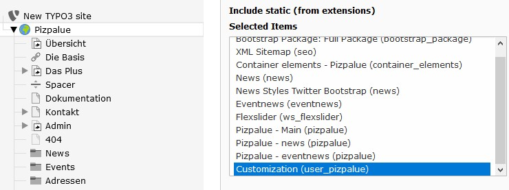

.. include:: ../Includes.txt

.. _administration:

==============
Administration
==============

Installation
============

The distribution can be installed from within the distribution list, by uploading the extension and through composer.
Refer to TYPO3 documentation for further details on
`installing extensions <https://docs.typo3.org/m/typo3/guide-installation/master/en-us/ExtensionInstallation/Index.html>`__.

Required extensions
-------------------

The following extensions will be installed with the distribution:

================================ ================
Extension                        Version
================================ ================
pizpalue                         11.2.0-11.99.99
pp_gridelements                  1.1.0-1.99.99
================================ ================

Supported extensions
--------------------

The distribution supports the same extensions as the extension `pizpalue`. Head over to its
`administration chapter <https://docs.typo3.org/p/buepro/typo3-pizpalue/master/en-us/Administration/Index.html#supported-extensions>`__
to see the details.

.. note::

   In case one of the supported extensions is being used it **should be installed prior** installing this distribution.
   This ensures that already predefined records for supported extensions are being imported during installing the
   distribution.

Extension manager
-----------------

Follow these steps to install the distribution through the extension manager:

#. Go to the extension manager
#. Install `supported extensions` as needed
#. Select `Get preconfigured distribution`
#. Search for `Pizpalue Distribution` and install it

Composer
--------

In the following code snippets TYPO3 with the extension `pizpalue_distribution` will be installed in the directory
`pizpalue`.

.. note::
   In case you encounter a problem with the typo3 console test if **remote db connection** is required and the host
   configuration is correct (:php:`'host' => '127.0.0.1'`).

.. rst-class:: bignums

1. Install TYPO3 (optional)

   .. code-block:: bash

      composer create-project typo3/cms-base-distribution pizpalue
      cd pizpalue

   After the packages have been added the installation setup has to be carried out. This can be done by walking
   through the installation wizard or by command (replace credentials in `[]`-brackets):

   .. code-block:: bash

      vendor/bin/typo3cms install:setup \
      --no-interaction \
      --database-user-name='[database_user_name]' \
      --database-user-password='[database_password]' \
      --database-name='[database_name]' \
      --use-existing-database \
      --admin-user-name='[admin_user_name]' \
      --admin-password='[admin_password]' \
      --site-name='[site_name]' \
      --web-server-config='apache'

2. Adding supported extensions (optional)

   Just include needed extensions. To include all supported extensions use:

   .. code-block:: bash

      composer req buepro/typo3-flux-elements
      composer req buepro/typo3-container-elements

   .. warning::
      Not all extensions might support the current TYPO3 version. Please check the compatibility
      prior installing an extension.

3. Adding extension `pizpalue_distribution`

   .. code-block:: bash

      composer req buepro/typo3-pizpalue-distribution

4. Update data base schema

   .. code-block:: bash

      vendor/bin/typo3cms database:updateschema

5. Deactivate `flux`

   .. code-block:: bash

      vendor/bin/typo3cms extension:deactivate flux_elements
      vendor/bin/typo3cms extension:deactivate flux

   .. note::
      `Flux` needs to be deactivated because nested flux elements can cause error when importing data.

6. Reactivate extensions

   .. code-block:: bash

      vendor/bin/typo3cms extension:setupactive
      vendor/bin/typo3cms extension:deactivate user_pizpalue
      vendor/bin/typo3cms extension:deactivate pizpalue_distribution
      vendor/bin/typo3cms extension:deactivate pizpalue
      vendor/bin/typo3cms extension:deactivate bootstrap_package
      vendor/bin/typo3cms extension:activate bootstrap_package
      vendor/bin/typo3cms extension:activate pizpalue
      vendor/bin/typo3cms extension:activate pizpalue_distribution
      vendor/bin/typo3cms extension:activate user_pizpalue
      vendor/bin/typo3cms extension:activate flux
      vendor/bin/typo3cms extension:activate flux_elements
      vendor/bin/typo3cms cache:flush

   .. note::
      The extensions `user_pizpalue`, `pizpalue_distribution`, `pizpalue` and `bootstrap_package` need to be
      reactivated to execute scrips not being triggered by `vendor/bin/typo3cms extension:setupactive`.

7. Update database reference index (optional)

   .. code-block:: bash

      vendor/bin/typo3cms referenceindex:update

8. Copy `.htaccess` (optional, mostly not needed)

   .. code-block:: bash

      cp public/typo3/sysext/install/Resources/Private/FolderStructureTemplateFiles/root-htaccess public/.htaccess

Customization
=============

The suggested way to customize the distribution for customer projects is to create an extension (e.g. user_pizpalue)
and define the customer theme and functions in it (`see TYPO3 documentation
<https://docs.typo3.org/typo3cms/ExtbaseFluidBook/4-FirstExtension/Index.html>`__).

An example extension for that purpose is delivered and activated with the distribution. You might use it as your
starting point.

   Customize the distribution for customer projects

The extension might be deactivated by removing its static template or by uninstalling it. To prevent the extension
`user_pizpalue` from being installed the checkbox `Install customer extension` in the `Extension
Configuration` from the settings module might be deactivated.
