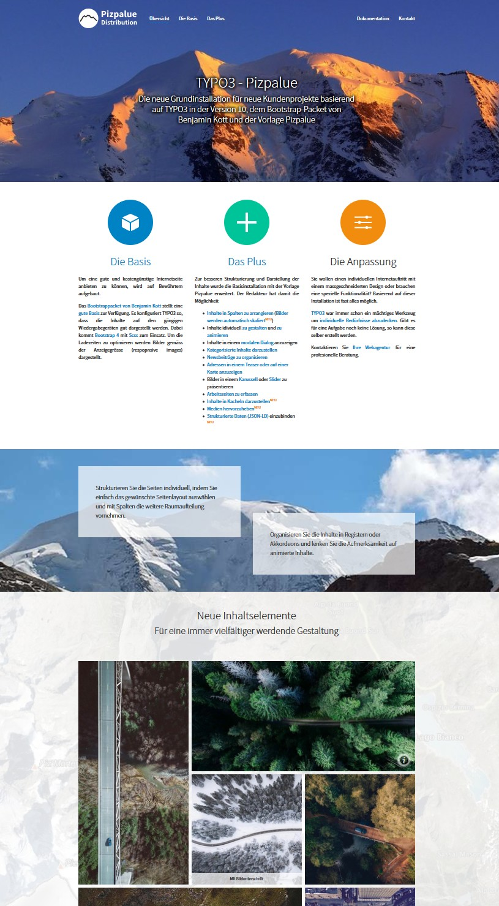
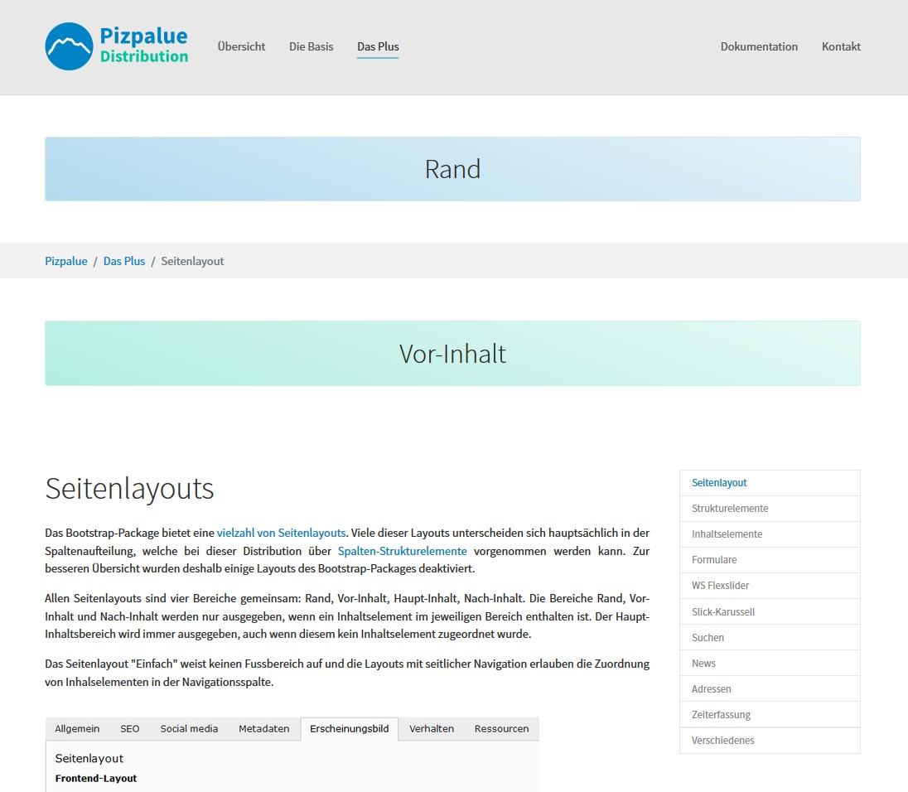

.. include:: ../Includes.txt

.. _introduction:

============
Introduction
============

.. figure:: ../Images/Introduction/Distribution.png

Description
===========

This distribution extension installs a bootstrap based web site using the
`template extension pizpalue <https://extensions.typo3.org/extension/pizpalue>`__.

The web site features everything needed for private or corporate use. It is tailored to the Swiss market featuring
German as default language and additional translations to French, English and Finnish.

This distribution mainly provides the pages and content of the website and its configuration. The functionality is
primarily provided by the `extension pizpalue <https://extensions.typo3.org/extension/pizpalue>`__, which provides
new features and complements other extensions.

The following extensions complement this distribution:

- `pp_gridelements <https://extensions.typo3.org/extension/pp_gridelements>`__, structure elements

Additional features are ready to be used and just need to be activated by installing the related extension:

- `news <https://extensions.typo3.org/extension/news>`__, news system
- `tt_address <https://extensions.typo3.org/extension/tt_address>`__, address lists
- `indexed_search <https://docs.typo3.org/c/typo3/cms-indexed-search/master/en-us/>`__, website search
- `flux_elements <https://extensions.typo3.org/extension/flux_elements>`__, structure elements
- `timelog <https://extensions.typo3.org/extension/timelog>`__, time and activity registration for projects
- `slickcarousel <https://extensions.typo3.org/extension/slickcarousel>`__, carousel
- `ws_flexslider <https://extensions.typo3.org/extension/ws_flexslider>`__, carousel

Discover the functionality by browsing through the `demo site <https://www.pizpalue.buechler.pro/>`__.

Screenshots
===========

See as well `screenshots from pizpalue manual <https://docs.typo3.org/p/buepro/typo3-pizpalue/master/en-us/Introduction/Index.html#screenshots>`__

Landing page
------------

See as well `demo site <https://pizpalue.buechler.pro/>`__.

----

Additions page
--------------

See as well `demo site <https://pizpalue.buechler.pro/das-plus/>`__.

----

Timelog
-------

See as well `demo site <https://pizpalue.buechler.pro/das-plus/timelog>`__

.. figure:: ../Images/Introduction/Timelog.jpg
   :width: 500px
   :alt: Timelog

Credits
=======

See `section credits from pizpalue manual <https://docs.typo3.org/p/buepro/typo3-pizpalue/master/en-us/Introduction/Index.html#credits>`__
